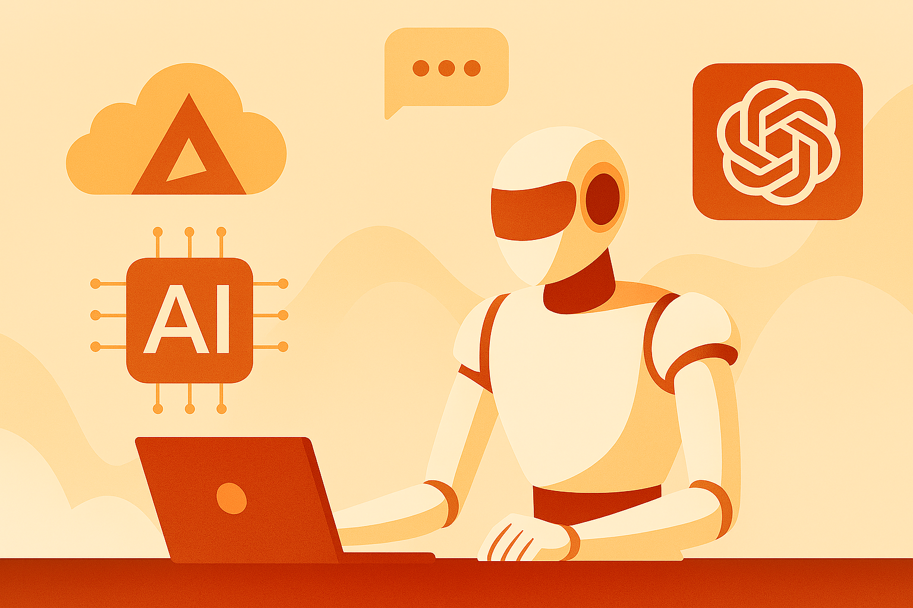

## 『AIエージェント開発ハンズオンセミナー』(開発者向け) チュートリアル

### ■ AIエージェントの作成 (LLM利用) - Azure OpenAIの利用


この手順では、LLM として Azure OpenAI も利用できるようにエージェントを改良していきます。

○ パッケージを追加でインストール

```console
dotnet add package Azure.AI.OpenAI
dotnet add package Microsoft.Agents.AI.OpenAI --prerelease
```

○ Program.cs を下記のようにに書き換え

```csharp
// Program.cs
//
// 【概要】
// Microsoft.Agents.AI フレームワークを使用した、AI エージェントの実装例
// 指定されたチャットクライアント(Ollama / Azure OpenAI)を利用
//
// 【前提条件】
// - Ollama がインストールされ、http://localhost:11434 で起動していること
// - Ollama でモデル "gpt-oss:20b-cloud" が利用可能であること
// - Azure OpenAI が作成され、エンドポイントと API キーが取得できていること
//
// 【実行方法】
// dotnet run --project FCAIAgent2
//
// 【動作説明】
// 1. チャットクライアント(Ollama / Azure OpenAI)を生成
// 2. ChatClientAgent を作成(エージェント名と指示を設定)
// 3. ユーザープロンプトを送信して応答を取得
// 4. 応答内容をコンソールに出力

using System;
// Microsoft Agent Framework 用
using Microsoft.Extensions.AI;
using Microsoft.Agents.AI;
// Ollama 用
using OllamaSharp;
// 新: ここから
// Azure OpenAI のクライアント用
using Azure;
using Azure.AI.OpenAI;
// 新: ここまで

// 旧: using IChatClient chatClient = GetOllamaClient();
// 新: ここから
// 使用するチャットクライアント種別
const My.ChatClientType chatClientType = My.ChatClientType.AzureOpenAI;
using IChatClient       chatClient     = My.GetChatClient(chatClientType);
// 新: ここまで

// ChatClientAgent の作成 (Agent の名前やインストラクションを指定する)
AIAgent agent = new ChatClientAgent(
    chatClient,
    new ChatClientAgentOptions {
        Name         = My.AgentName   ,
        Instructions = My.Instructions
    }
);

try {
    // エージェントを実行して結果を表示する
    AgentRunResponse response = await agent.RunAsync(My.UserPrompt);
    Console.WriteLine(response.Text);
} catch (Exception ex) {
    Console.WriteLine($"Error running agent: {ex.Message}");
}

// 上記コード中の型や定数、メソッドが自作のものかどうかを判別しやすくするためにクラスに格納
static class My
{
    // エージェント名と指示
    public const string AgentName    = "AIエージェント";
    public const string Instructions = "あなたはAIエージェントです";
    // ユーザーからのプロンプトの例
    public const string UserPrompt   = "「AIエージェント」とはどのようなものですか?";

    // Ollama を使う場合のクライアント生成(ローカルの Ollama サーバーに接続)
    static IChatClient GetOllamaClient()
    {
        var uri    = new Uri("http://localhost:11434");
        var ollama = new OllamaApiClient(uri);
        // 使用するモデルを指定
        // クラウドベースのモデルを使用(実行速度の向上のため)
        // ローカル LLM を使用する場合は "gemma3:latest" などに変更してください
        ollama.SelectedModel = "gpt-oss:20b-cloud";

        // IChatClient インターフェイスに変換して、ツール呼び出しを有効にしてビルド
        IChatClient chatClient = ollama;
        chatClient = chatClient.AsBuilder()
                               .UseFunctionInvocation() // ツール呼び出しを使う
                               .Build();
        return chatClient;
    }

    // 新: ここから Azure OpenAI を使う場合のクライアント生成
    static IChatClient GetAzureOpenAIClient()
    {
        // 使用するモデルを指定
        const string deploymentName = "gpt-5-mini";
        var azureOpenAIEndPoint     = GetEndPoint();
        var openAIApiKey            = GetKey     ();
        var credential              = new AzureKeyCredential(openAIApiKey);

        var azureOpenAIClient       = new AzureOpenAIClient(new Uri(azureOpenAIEndPoint), credential);
        // IChatClient インターフェイスに変換して、ツール呼び出しを有効にしてビルド
        IChatClient chatClient      = azureOpenAIClient.GetChatClient(deploymentName)
                                                       .AsIChatClient()
                                                       .AsBuilder()
                                                       .UseFunctionInvocation() // ツール呼び出しを使う
                                                       .Build();
        return chatClient;

        static string GetEndPoint()
        {
            //const string AzureOpenAIEndpointEnvironmentVariable = "AZURE_OPENAI_ENDPOINT";
            //var azureOpenAIEndPoint = Environment.GetEnvironmentVariable(AzureOpenAIEndpointEnvironmentVariable);
            //if (string.IsNullOrEmpty(azureOpenAIEndPoint))
            //    throw new InvalidOperationException($"Please set the {AzureOpenAIEndpointEnvironmentVariable} environment variable.");
            //return azureOpenAIEndPoint;

            // 上記のように、セキュリティ上 Azure OpenAI のエンドポイントは環境変数から取得するのが望ましいが、ここではハードコードする
            // 例: 1234567890abcdef1234567890abcdef1234567890abcdef1234567890abcdef
            return @"[Azure OpenAI のエンドポイント]";
        }

        static string GetKey()
        {
            //const string AzureOpenAIApiKeyEnvironmentVariable = "AZURE_OPENAI_API_KEY";
            //var openAIApiKey = Environment.GetEnvironmentVariable(AzureOpenAIApiKeyEnvironmentVariable);
            //if (string.IsNullOrEmpty(openAIApiKey))
            //    throw new InvalidOperationException($"Please set the {AzureOpenAIApiKeyEnvironmentVariable} environment variable.");
            //return openAIApiKey!;

            // 上記のように、セキュリティ上 Azure OpenAI の APIキーは環境変数から取得するのが望ましいが、ここではハードコードする
            //例: https://your-resource-name.openai.azure.com/
            return @"[Azure OpenAI の APIキー]";
        }
    }

    // ChatClientType に基づいて適切な IChatClient を返すファクトリ関数
    public static IChatClient GetChatClient(My.ChatClientType chatClientType)
        => chatClientType switch {
            My.ChatClientType.Ollama      => My.GetOllamaClient     (),
            My.ChatClientType.AzureOpenAI => My.GetAzureOpenAIClient(),
            _ => throw new NotSupportedException($"Chat client type '{chatClientType}' is not supported.")
        };

    // チャットクライアントの種別
    public enum ChatClientType
    {
        AzureOpenAI,
        Ollama
    }
    // 新: ここまで
}

```

○ 動作確認

```console
dotnet run
```

- 実行例

```console
簡潔に言うと、AIエージェントとは「周囲（環境）を観察して判断し、何らかの行動をとるソフトウェアやロボット」のことです。もう少し詳しく要点を整理します。

- 基本的な構成
  - センサー（観察）：環境から情報を取得する機能（カメラ、マイク、ログデータなど）。
  - 知識・モデル：世界や自分の状態を表す内部表現（ルールベースや確率モデル、ニューラルネットワークなど）。
  - 目標・報酬：何を達成すべきかを示す基準（タスク、報酬関数、ユーティリティ）。
  - 判断・計画（ポリシー）：観察と目標に基づいて行動を選ぶ仕組み（ルール、推論、強化学習など）。
  - アクチュエータ（実行）：行動を環境に反映する手段（モーター、API呼び出し、メッセージ送信など）。
……
```
