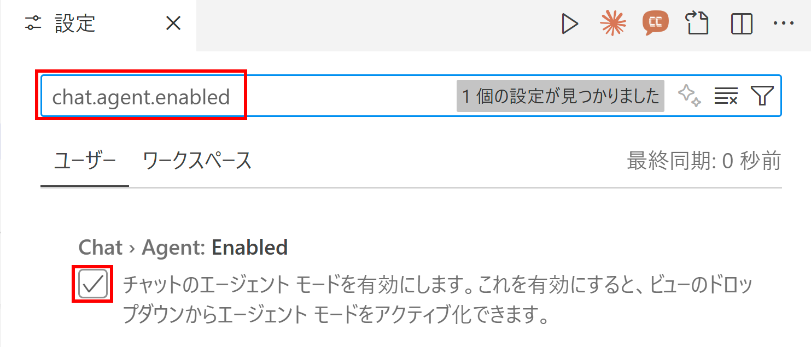
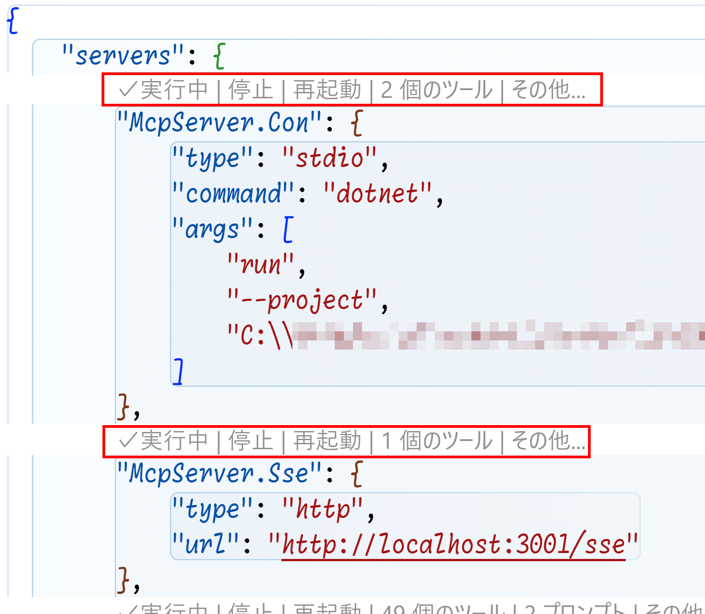
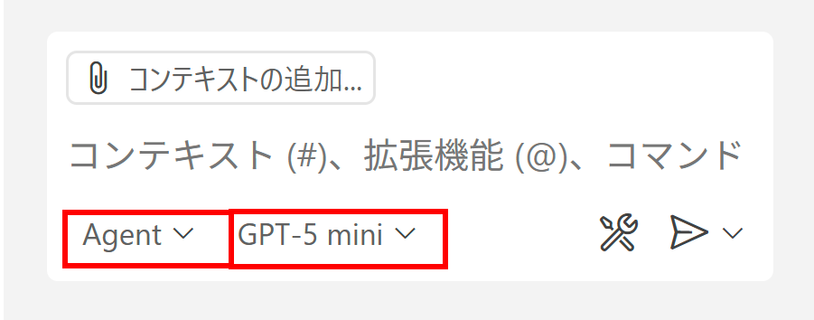
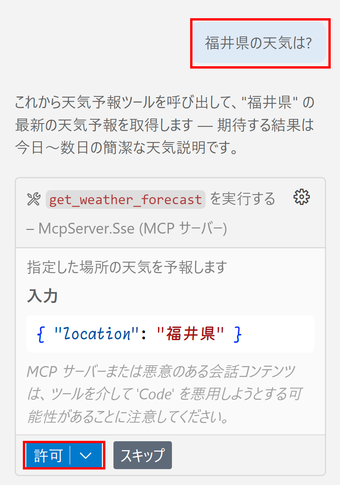
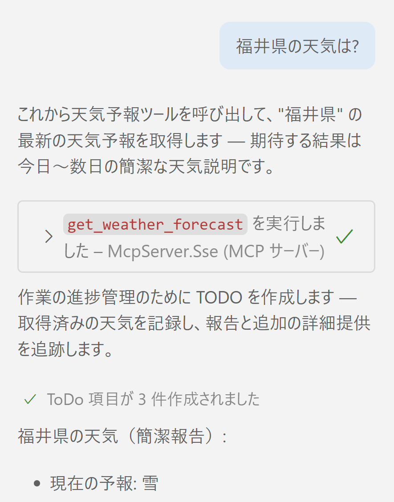
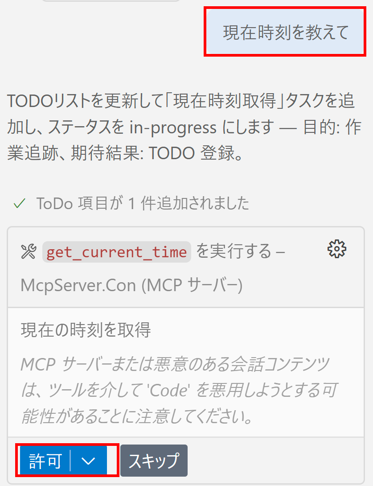
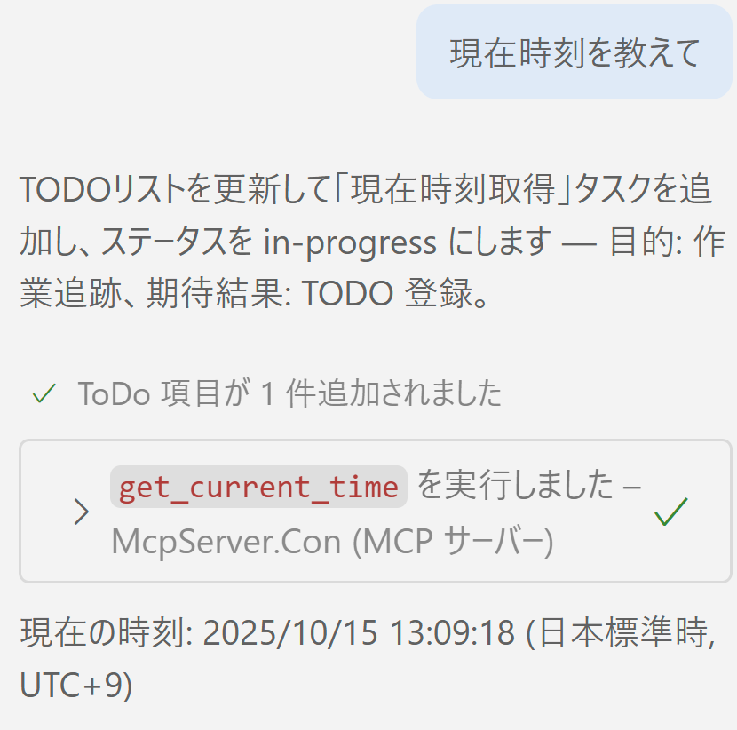
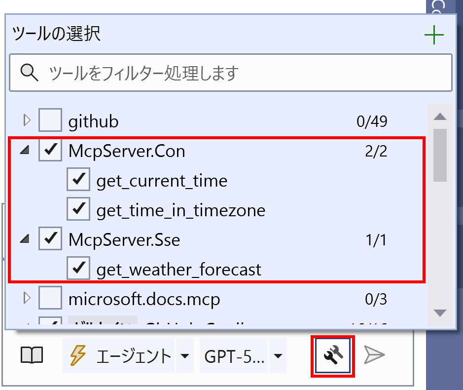

## 『AIエージェント開発ハンズオンセミナー』(開発者向け) チュートリアル

### ■ 【参考】MCP サーバーの動作確認

この手順では、作成した MCP サーバーが正しく動作するかを、Visual Studio Code または Visual Studio の GitHub Copilot を使って確認します。

使用している IDE に応じて、該当するセクションを参照してください:

Visual Studio Code を使用している場合 → 「Visual Studio Code の場合」
Visual Studio を使用している場合 → 「Visual Studio の場合」

#### ○ Visual Studio Code の場合

1. Visual Studio Code への GitHub Copilot の設定

- Visual Studio Code への GitHub Copilot の設定方法: [Set up GitHub Copilot in VS Code](https://code.visualstudio.com/docs/copilot/setup)

2. Agent モードの有効化

Visual Studio Code を起動し、設定を開く

\"chat.agent.enabled\" で検索し、チェックが入っていなければチェック


3. メニュー -「表示」-「コマンド パレット」

4. 「MCP サーバーの追加」コマンドを実行


5. 「コマンド (stdio) MCP プロトコルを実装するローカル コマンドを実行する」を選択


6. 「コマンドの入力」では、「実行するコマンド」に \"dotnet  run --project [McpServer\.Con\.csprojのフルパス]\" と入力して Enter
- [McpServer\.Con\.csprojのフルパス] の部分は、実際のもので置き換えてください<br>
  (例. C:\\\\Source\\\\FCAIAgentSample\\\\McpServer.Con\\\\McpServer.Con.csproj)


7. 「サーバー ID の入力」で \"McpServer.Con\" と入力して Enter


8. 「MCP サーバーをインストールする場所を選択する」では「ワークスペース このワークスペースで利用可能で、ローカルで実行されます」を選択


9. 再度「MCP サーバーの追加」コマンドを実行


10. 「HTTP (HTTP またはサーバー送信イベント) MCP プロトコルを実装するリモート HTTP サーバーに接続する」を選択


11. 「サーバー URL の入力」では \"http://localhost:3001/sse\" と入力して Enter


12. 「サーバー ID の入力」で \"McpServer.Sse\" と入力して Enter


13. 「MCP サーバーをインストールする場所を選択する」では「ワークスペース このワークスペースで利用可能で、ローカルで実行されます」を選択


14. 次のファイルが作成される

[ソリューション フォルダー]\\\.vscode\\mcp\.json
```json
{
  "servers": {
    "McpServer.Con": {
      "type": "stdio",
      "command": "dotnet",
      "args": [
        "run",
        "--project",
        "[McpServer.Con.csprojのフルパス]"
      ]
    },
    "McpServer.Sse": {
      "type": "http",
      "url": "http://localhost:3001/sse"
    }
  },
  "inputs": []
}
```
※ [McpServer\.Con\.csprojのフルパス] の部分は、実際のもので置き換わります

15. ツールの確認

- 予め McpServer\.Sse を実行しておく
  - Visual Studio のメニューの「ツール」-「コマンド ライン」-「開発者コマンド プロンプト」
```console
cd McpServer.Sse
dotnet run
```


mcp\.json ファイルを開き、正常に起動していないものがあれば、起動

[ソリューション フォルダー]\\\.vscode\\mcp\.json


16. 「チャットを開く」




17.  実行結果










#### ○ Visual Studio の場合

1. GitHub アカウントと GitHub へのサインインが必要


2. メニュー -「ツール」-「オプション」でオプション ダイアログを表示

3. 「GitHub」-「Copilot」


4. ソリューション フォルダーに \"\.mcp\.json\" ファイルを作成

[ソリューション フォルダー]\\\.mcp\.json
```json
{
  "servers": {
    "McpServer.Con": {
      "type": "stdio",
      "command": "dotnet",
      "args": [
        "run",
        "--project",
        "[McpServer.Con.csprojのフルパス]"
      ]
    },
    "McpServer.Sse": {
      "type": "http",
      "url": "http://localhost:3001/sse"
    },
    "github": {
      "type": "http",
      "url": "https://api.githubcopilot.com/mcp/"
    },
    "microsoft.docs.mcp": {
      "type": "http",
      "url": "https://learn.microsoft.com/api/mcp"
    }
  },
  "inputs": []
}

```
- [McpServer\.Con\.csprojのフルパス] の部分は、実際のもので置き換えてください<br>
  (例. C:\\\\Source\\\\FCAIAgentSample\\\\McpServer.Con\\\\McpServer.Con.csproj)

5. 「GitHub Copilot」-「チャット ウィンドウを開く」


6. ツールの確認

- 予め McpServer\.Sse を実行しておく
  - Visual Studio のメニューの「ツール」-「コマンド ライン」-「開発者コマンド プロンプト」
```console
cd McpServer.Sse
dotnet run
```



\.mcp\.json ファイルを開き、正常に起動していないものがあれば、起動

[ソリューション フォルダー]\\\.mcp\.json

